# My Shop – PHP E-Commerce Website

A small e-commerce web application built with **PHP, MySQL, HTML, CSS, and JavaScript**. You can click the headings icon to go to any sections, such as the setup to locally run the site, or the screenshots section

This project demonstrates:
- PHP backend development
- Database-driven pages
- CRUD operations
- Clean project structure
- Safe handling of configuration and clutter files using .gitignore
- Git and GitHub workflow

---

## Website Features

- Shop listing from database and pagination
- Categories and filtering
- Customer account, registration and login
- Shopping cart logic
- Product detail page, that also suggests related products
- Contact page (in the site's footer) to send feedback to site admins
- Admin-side dashboard for user-friendly database interactions and site management
- Object-Oriented Programming with a PDO-based database abstraction using my "Database" class
- Elegant and responsive UI

---

## My Tech Stack

- PHP
- MySQL
- HTML, CSS, JavaScript, AJAX, jQuery
- Bootstrap
- Git, GitHub

---

## Prerequisites

To install and run this project locally, having the following is needed:

- XAMPP
- Git
- Web browser
- Internet connection (website works offline after downloading it but some icons and UI elements are sourced from CDNs)

---

## Setup instructions

### 1. Start XAMPP

- Open the XAMPP control panel
- Start the following services:
    - Apache
    - MySQL

---

### 2. Navigate to XAMPP's web root

- Click the Explorer button in the control panel
- Enter "htdocs"

---

### 3. Clone the repository 

- Hold Shift button while right-clicking inside the htdocs folder
- Click "Open PowerShell window here"
- Download the repo by copying the following command into PowerShell and pasting:

```bash
    git clone https://github.com/Khaled-Salah-El-Din/My-Shop.git my-shop-demo
```

### 4. Configure the database credentials

```bash
    cd my-shop-demo
    copy config/database.example.php config/database.php
    @"
<?php

return [
    'host'   => 'localhost',
    'dbname' => 'my_shop_demo',
    'user'   => 'root',
    'pass'   => '',
];
"@ | Set-Content config/database.php
```

- NOTE: This works for default XAMPP setups. Only if you have different credentials and the above doesn't load the database, then please open and edit "config/database.php" with the following command to match your local MySQL setup:

```bash
notepad config/database.php
```

---

### 4. Import the database file

- Open phpMyAdmin in your browser with:

```bash
   start http://localhost/phpmyadmin
```

- Create a new database from the sidebar by clicking "New"
- Name it "my_shop_demo" if following default config, or give it the name you edited there
- Click "Create"
- Import the SQL file by drag-and-dropping it into the phpMyAdmin window
    - To quickly find the file, use the following command:

```bash
    explorer.exe /select,"website_project.sql"
```

---

### 5. Open the website

Visit the store homepage with:

```bash
   start http://localhost/my-shop-demo
```

You may also visit the admin dashboard with:

```bash
   start http://localhost/my-shop-demo/admin
```

And login with username "ahmad" and password "123" for testing and demo purposes

---

## Screenshots

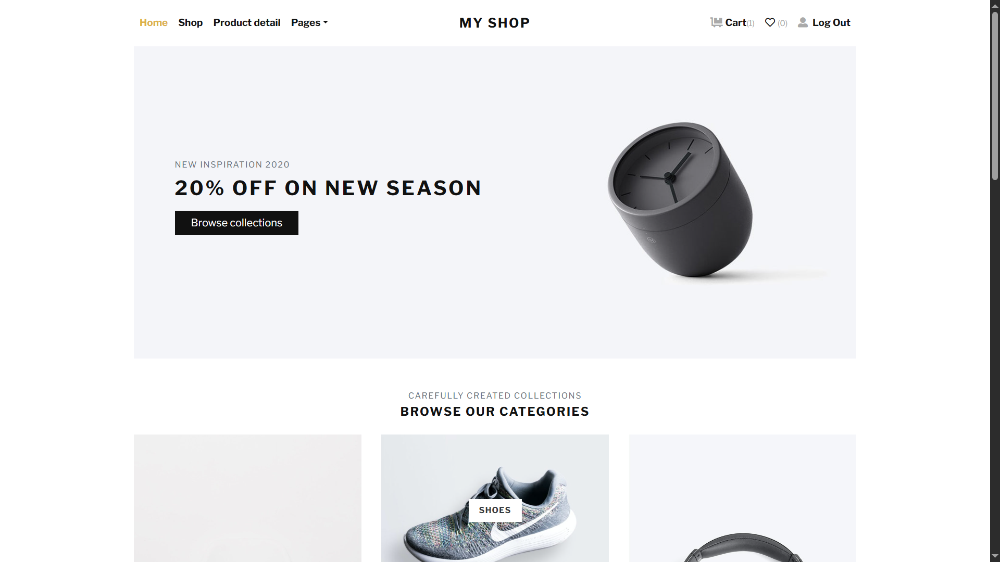
<p style="text-align:center;"><small>Storefront's Homepage</small></p>

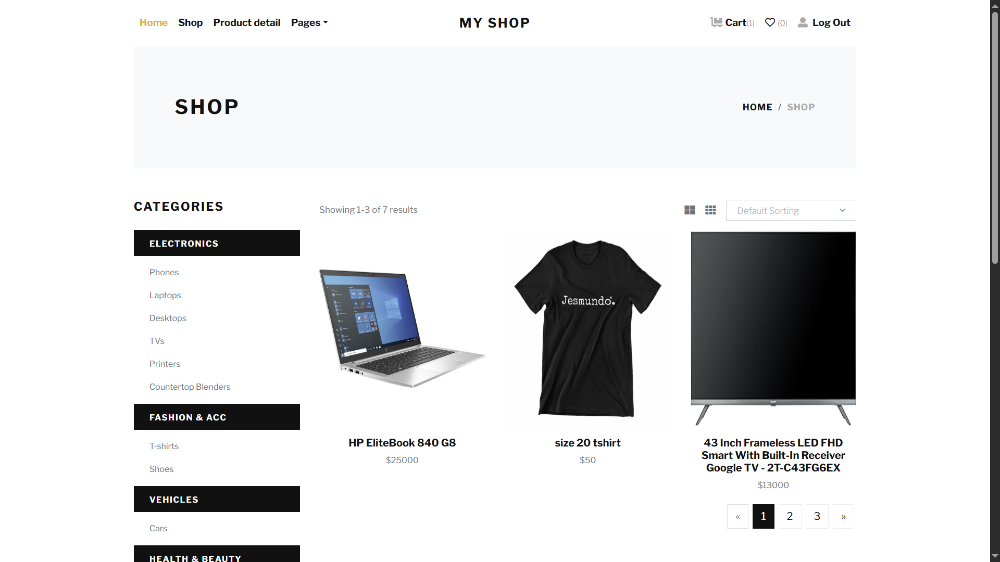
<p style="text-align:center;"><small>Storefront's Products</small></p>

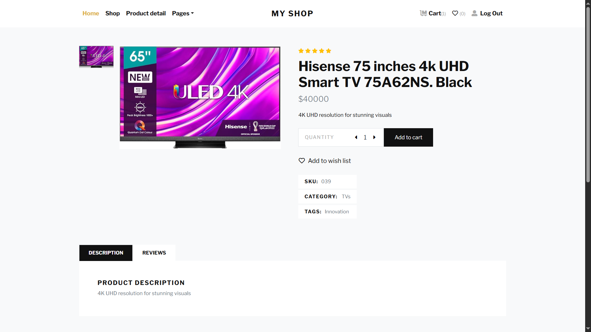
<p style="text-align:center;"><small>Storefront's Product Details</small></p>

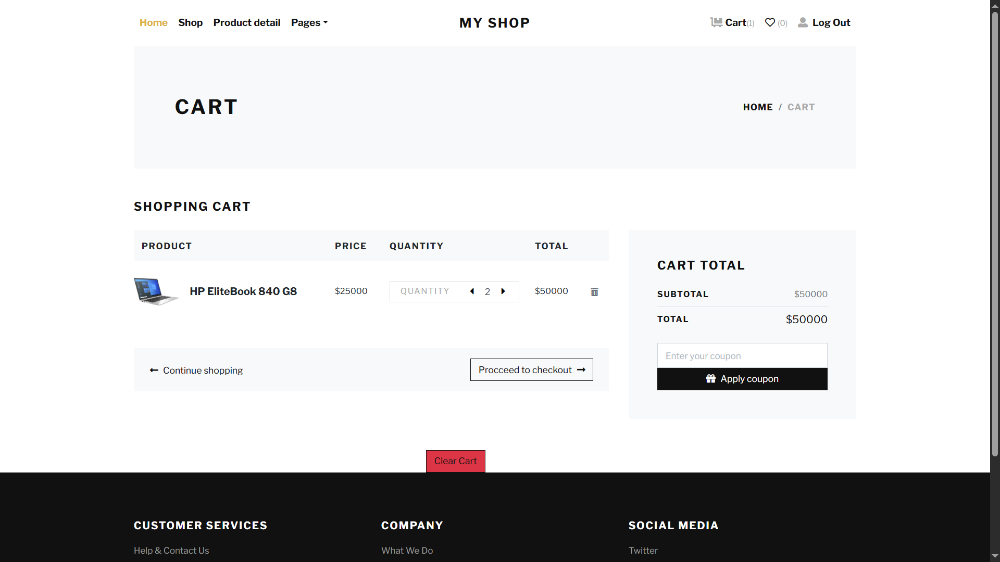
<p style="text-align:center;"><small>Storefront's Cart</small></p>

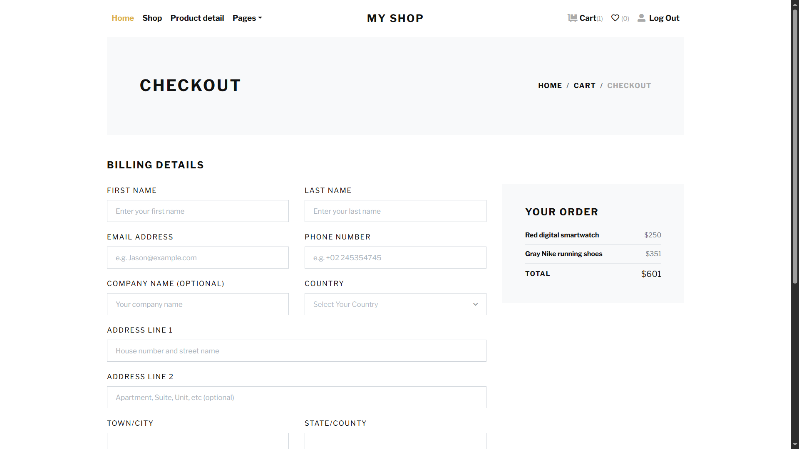
<p style="text-align:center;"><small>Storefront's Checkout</small></p>


<p style="text-align:center;"><small>Storefront's Contact Us</small></p>

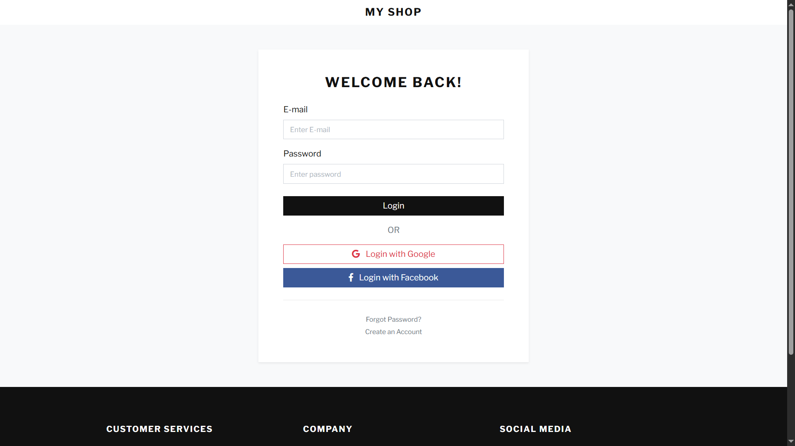
<p style="text-align:center;"><small>Storefront's Login</small></p>

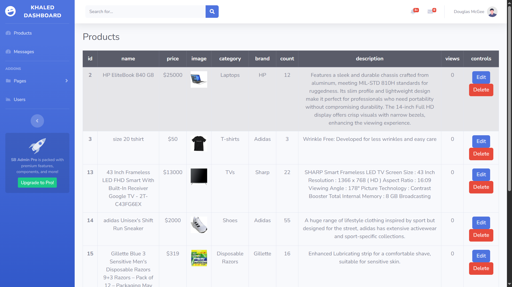
<p style="text-align:center;"><small>Dashboard's Products</small></p>

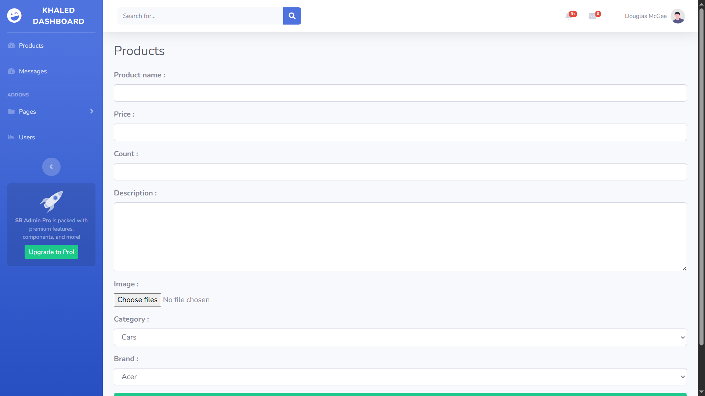
<p style="text-align:center;"><small>Dashboard's Product Addition</small></p>

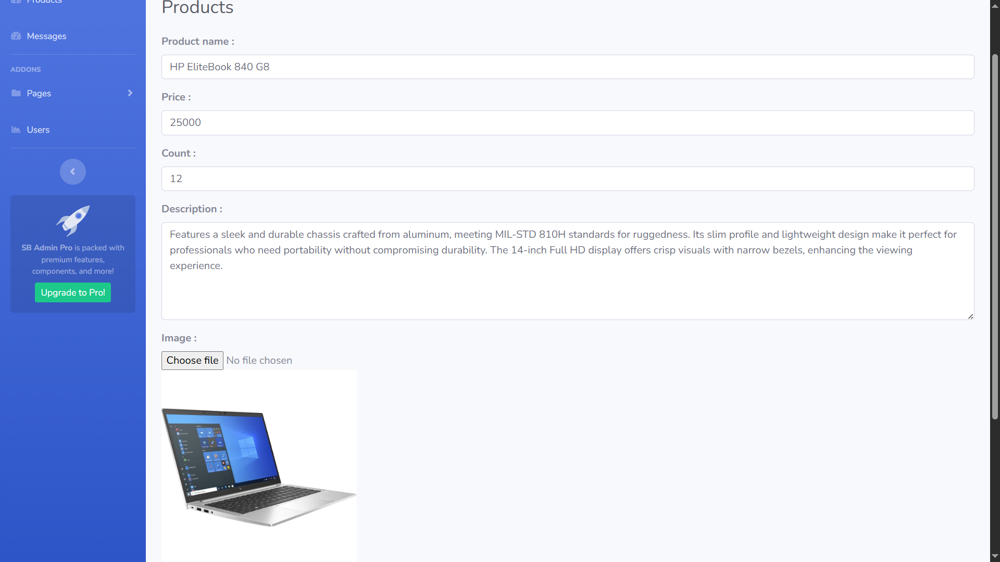
<p style="text-align:center;"><small>Dashboard's Product Editing</small></p>

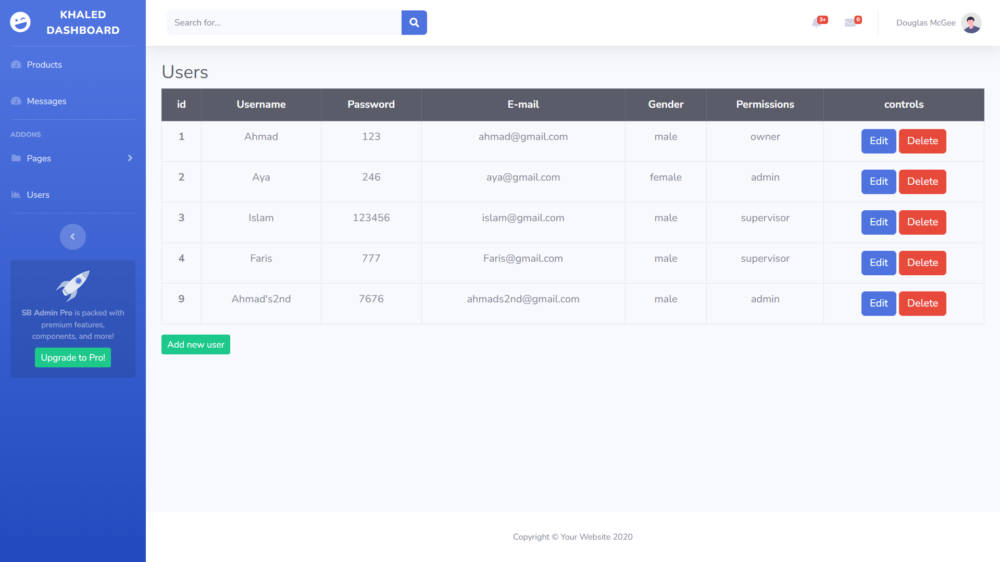
<p style="text-align:center;"><small>Dashboard's Users</small></p>

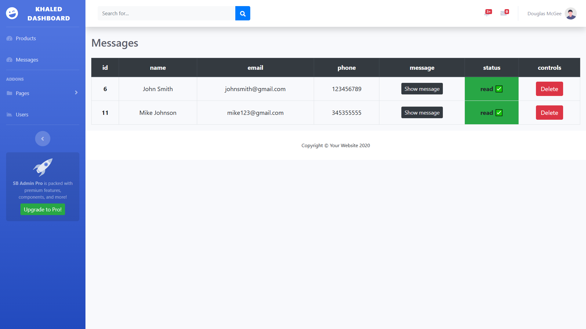
<p style="text-align:center;"><small>Dashboard's Messages From Customers</small></p>

## Project Scope & Disclaimer

This project was built for learning and portfolio demonstration purposes only.

- Product data, prices, and user accounts are dummy/sample data
- No real payment processing is implemented
- Authentication and security are suitable for demo use only